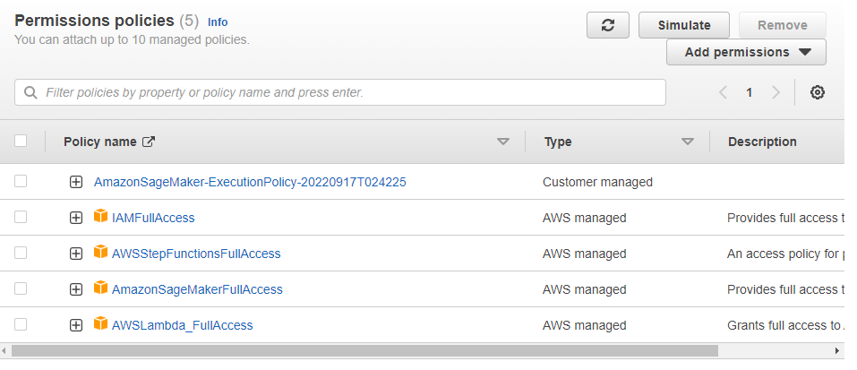

# Deploy and Monitor a Machine Learning workflow for Image Classification

## Project Introduction

## Background

Image Classifiers are used in the field of computer vision to identify the content of an image and it is used across a broad variety of industries, from advanced technologies like autonomous vehicles and augmented reality, to eCommerce platforms, and even in diagnostic medicine.

You are hired as a Machine Learning Engineer for a scone-delivery-focused logistics company, Scones Unlimited, and you’re working to ship an Image Classification model. The image classification model can help the team in a variety of ways in their operating environment: detecting people and vehicles in video feeds from roadways, better support routing for their engagement on social media, detecting defects in their scones, and many more!

In this project, you'll be building an image classification model that can automatically detect which kind of vehicle delivery drivers have, in order to route them to the correct loading bay and orders. Assigning delivery professionals who have a bicycle to nearby orders and giving motorcyclists orders that are farther can help Scones Unlimited optimize their operations.

As an MLE, your goal is to ship a scalable and safe model. Once your model becomes available to other teams on-demand, it’s important that your model can scale to meet demand, and that safeguards are in place to monitor and control for drift or degraded performance.

In this project, you’ll use AWS Sagemaker to build an image classification model that can tell bicycles apart from motorcycles. You'll deploy your model, use AWS Lambda functions to build supporting services, and AWS Step Functions to compose your model and services into an event-driven application. At the end of this project, you will have created a portfolio-ready demo that showcases your ability to build and compose scalable, ML-enabled, AWS applications.

## Setting up this notebook

Notes about the instance size and kernel setup: this notebook has been tested on

1. The `Python 3 (Data Science)` kernel
2. The `ml.t3.medium` Sagemaker notebook instance

**Project Steps Overview**

<ol>
    <li>Step 1: Data staging</li>
    <li> Step 2: Model training and deployment</li>
    <li> Step 3: Lambdas and step function workflow</li>
    <li> Step 4: Testing and evaluation</li>
    <li> Step 5: Optional challenge</li>
    <li> Step 6: Cleanup cloud resources</li>
</ol>

<h2>Data staging</h2>

We'll use a sample dataset called CIFAR to simulate the challenges Scones Unlimited are facing in Image Classification. In order to start working with CIFAR we'll need to:

1. Extract the data from a hosting service
2. Transform it into a usable shape and format
3. Load it into a production system

In other words, we're going to do some simple ETL!

### 1. Extract the data from the hosting service

define a function `extract_cifar_data` that extracts python version of the CIFAR-100 dataset. The CIFAR dataaset is open source and generously hosted by the University of Toronto at: https://www.cs.toronto.edu/~kriz/cifar-100-python.tar.gz 


```python
import requests

def extract_cifar_data(url, filename="cifar.tar.gz"):
    """A function for extracting the CIFAR-100 dataset and storing it as a gzipped file
    
    Arguments:
    url      -- the URL where the dataset is hosted
    filename -- the full path where the dataset will be written
    
    """
    
    # Todo: request the data from the data url
    # Hint: use `requests.get` method
    r = requests.get(url)
    with open(filename, "wb") as file_context:
        file_context.write(r.content)
    return
```
Run the function below and check whether a new file `cifar.tar.gz` is created in the file explorer.

```python
extract_cifar_data("https://www.cs.toronto.edu/~kriz/cifar-100-python.tar.gz") 
```


**1. Image_1**

Looking at the file browser, the left side of the image, you can see some file creates  including `cifar.tar.gz`.

### 2. Transform the data into a usable shape and format

Clearly, distributing the data as a gzipped archive makes sense for the hosting service! It saves on bandwidth, storage, and it's a widely-used archive format. In fact, it's so widely used that the Python community ships a utility for working with them, `tarfile`, as part of its Standard Library. Execute the following cell to decompress your extracted dataset:

```python
import tarfile

with tarfile.open("cifar.tar.gz", "r:gz") as tar:
    tar.extractall()
```

A new folder `cifar-100-python`  should be created, containing `meta`, `test`, and `train` files. See **1. Image_1**

These files are `pickles` and the [CIFAR homepage](https://www.cs.toronto.edu/~kriz/cifar.html) provides a simple script that can be used to load them. We've adapted the script below for you to run:


```python
import pickle

with open("./cifar-100-python/meta", "rb") as f:
    dataset_meta = pickle.load(f, encoding='bytes')

with open("./cifar-100-python/test", "rb") as f:
    dataset_test = pickle.load(f, encoding='bytes')

with open("./cifar-100-python/train", "rb") as f:
    dataset_train = pickle.load(f, encoding='bytes')
```

Displaying keys from the datasets b'filenames',	b'batch_label',	b'fine_labels',	b'coarse_labels' and 	b'data'

```python
dataset_train.keys()
```

As documented on the homepage, `b'data'` contains rows of 3073 unsigned integers, representing three channels (red, green, and blue) for one 32x32 pixel image per row.

```python
dataset_train[b'data'].shape
```
`(50000,3072)` giving you 50,000 rows training images, and 3072 columns representing  3 channels(red, green, and blue) and 32 by 32 pixels.

For a simple gut-check, let's transform one of our images. Each 1024 items in a row is a channel (red, green, then blue). 


Each 32 items in the channel are a row in the 32x32 image. Using python, we can stack these channels into a 32x32x3 (3072) array, and save it as a PNG file:
```python
import numpy as np

# Each 1024 in a row is a channel (red, green, then blue)
row = dataset_train[b'data'][0]
red, green, blue = row[0:1024], row[1024:2048], row[2048:]

# Each 32 items in the channel are a row in the 32x32 image
red = red.reshape(32,32)
green = green.reshape(32,32)
blue = blue.reshape(32,32)

# Combine the channels into a 32x32x3 image!
combined = np.dstack((red,green,blue))
```
For a more concise version, consider the following:
```python
test_image = np.dstack((
    row[0:1024].reshape(32,32),
    row[1024:2048].reshape(32,32),
    row[2048:].reshape(32,32)
))
```

Now that you know how to reshape the images, save them as files, and capture their filenames and labels, let's just capture all the bicycles and motorcycles and save them. Scones Unlimited can use a model that tells these apart to route delivery drivers automatically.

```python
import pandas as pd

# Todo: Filter the dataset_train and dataset_meta objects to find the label numbers for Bicycle and Motorcycles
def find_label_number(name):
    number=None
    name=name.lower()
    a_string="b'{}'".format(name)
    the_string=a_string.strip('')
    for i in dataset_meta[b'fine_label_names']:
        if str(i) ==str(the_string):
            number=dataset_meta[b'fine_label_names'].index(i)
    return number
    
            

print("Bicycle number is :",find_label_number('bicycle'))
print("Motorcycles number is :",find_label_number('Motorcycle'))

```
Bicycle number is : 8
Motorcycles number is : 48

**Construct DataFrame**
```python
#Construct the dataframe
df_train = pd.DataFrame({
    "filenames": dataset_train[b'filenames'],
    "labels": dataset_train[b'fine_labels'],
    "row": range(len(dataset_train[b'filenames']))
})

# Drop all rows from df_train where label is not 8 or 48
df_train = df_train[(df_train['labels']==8) | (df_train['labels']==48)]

# Decode df_train.filenames so they are regular strings
df_train["filenames"] = df_train["filenames"].apply(
    lambda x: x.decode("utf-8")
)


df_test = pd.DataFrame({
    "filenames": dataset_test[b'filenames'],
    "labels": dataset_test[b'fine_labels'],
    "row": range(len(dataset_test[b'filenames']))
})

# Drop all rows from df_test where label is not 8 or 48
df_test = df_test[(df_test['labels']==8) | (df_test['labels']==48)]

# Decode df_test.filenames so they are regular strings
df_test["filenames"] = df_test["filenames"].apply(
    lambda x: x.decode("utf-8")
)

```

Shows head of dataframe and saves train and test data as csv

Make directory
```python
!mkdir ./train
!mkdir ./test
```

save_images function saves image to train and test directories.

```python
def save_images(data,path):
    
    ind=data.labels
    rows=dataset_train[b'data'][ind]
    count=0
    for row in rows:
        # Consolidated stacking/reshaping from earlier
    
        target = np.dstack((
                row[0:1024].reshape(32,32),
                row[1024:2048].reshape(32,32),
                row[2048:].reshape(32,32)
            ))
        # Save the image
        plt.imsave(path+data.filenames.iloc[count],target)
        count+=1
    
    # Return any signal data you want for debugging
    return

# save ALL images using the save_images function
save_images(df_train,path='train/')
save_images(df_test,path='test/')
```

### 3. Load the data

Now we can load the data into S3.

Using the sagemaker SDK grab the current region, execution role, and bucket.

```python
import sagemaker
from sagemaker.session import Session
from sagemaker import get_execution_role

session = sagemaker.Session()

bucket= session.default_bucket()
print("Default Bucket: {}".format(bucket))

region = session.boto_region_name
print("AWS Region: {}".format(region))

role = get_execution_role() #sagemaker iam role
print("RoleArn: {}".format(role))
```

With this data we can easily sync your data up into S3!
```python
import os

os.environ["DEFAULT_S3_BUCKET"] = bucket
!aws s3 sync ./train s3://${DEFAULT_S3_BUCKET}/train/
!aws s3 sync ./test s3://${DEFAULT_S3_BUCKET}/test/
```


<h2> Model Training</h2>

For Image Classification, Sagemaker [also expects metadata](https://docs.aws.amazon.com/sagemaker/latest/dg/image-classification.html) e.g. in the form of TSV files with labels and filepaths. We can generate these using our Pandas DataFrames from earlier:

**Starting new session**

```python
session = sagemaker.Session()

bucket= session.default_bucket()
print("Default Bucket: {}".format(bucket))

region = session.boto_region_name
print("AWS Region: {}".format(region))

role = get_execution_role() #sagemaker iam role
print("RoleArn: {}".format(role))
```

```python
def to_metadata_file(df, prefix):
    df["s3_path"] = df["filenames"]
    df["labels"] = df["labels"].apply(lambda x: 0 if x==8 else 1)
    return df[["row", "labels", "s3_path"]].to_csv(
        f"{prefix}.lst", sep="\t", index=False, header=False
    )
    
to_metadata_file(df_train.copy(), "train")
to_metadata_file(df_test.copy(), "test")
```
We can also upload our manifest files:

```python
import boto3

# Upload files
boto3.Session().resource('s3').Bucket(
    bucket).Object('train.lst').upload_file('./train.lst')
boto3.Session().resource('s3').Bucket(
    bucket).Object('test.lst').upload_file('./test.lst')
```

Using the `bucket` and `region` info we can get the latest prebuilt container to run our training job, and define an output location on our s3 bucket for the model. Use the `image_uris` function from the SageMaker SDK to retrieve the latest `image-classification` image below:

```python
# Use the image_uris function to retrieve the latest 'image-classification' image 
algo_image = sagemaker.image_uris.retrieve('image-classification', region, 'latest')
s3_output_location = f"s3://{bucket}/models/image_model"
```

We're ready to create an estimator! Create an estimator `img_classifier_model` that uses one instance of `ml.p3.2xlarge`. Ensure that y ou use the output location we defined above - we'll be referring to that later!

```python
prefix='project2_model'
img_classifier_model=sagemaker.estimator.Estimator(algo_image, # The location of the container we wish to use
                                    role,                                    # What is our current IAM Role
                                    instance_count=1,                  # How many compute instances
                                    instance_type='ml.p3.2xlarge',      # What kind of compute instances
                                    output_path='s3://{}/{}/output'.format(bucket, prefix),
                                    sagemaker_session=session)
```

We will set few hyperparameters
```python
img_classifier_model.set_hyperparameters(
    image_shape='3,32,32', # representing 3 channels(red,green and blue) for 32 x 32 pixel image
    num_classes=2, # classes are bicycle and motorcycle
    num_training_samples= len(df_train)
)
```

The `image-classification` image uses four input channels with very specific input parameters. For convenience, we've provided them below:

```python
from sagemaker.debugger import Rule, rule_configs
from sagemaker.session import TrainingInput
model_inputs = {
        "train": sagemaker.inputs.TrainingInput(
            s3_data=f"s3://{bucket}/train/",
            content_type="application/x-image"
        ),
        "validation": sagemaker.inputs.TrainingInput(
            s3_data=f"s3://{bucket}/test/",
            content_type="application/x-image"
        ),
        "train_lst": sagemaker.inputs.TrainingInput(
            s3_data=f"s3://{bucket}/train.lst",
            content_type="application/x-image"
        ),
        "validation_lst": sagemaker.inputs.TrainingInput(
            s3_data=f"s3://{bucket}/test.lst",
            content_type="application/x-image"
        )
}
```

now we can train the model using the model_inputs. In the cell below, call the `fit` method on our model,:

```python
img_classifier_model.fit(model_inputs)
```


rememeber this definition `output_path='s3://{}/{}/output'.format(bucket, prefix)` inside sagemaker.estimator.Estimator()

**Hyperparameters used**
This is the default hyperparameters sagemaker used in training our model.
```json
default-input.json: {'use_pretrained_model': 0, 'num_layers': 152, 'epochs': 30, 'learning_rate': 0.1, 'lr_scheduler_factor': 0.1, 'optimizer': 'sgd', 'momentum': 0, 'weight_decay': 0.0001, 'beta_1': 0.9, 'beta_2': 0.999, 'eps': 1e-08, 'gamma': 0.9, 'mini_batch_size': 32, 'image_shape': '3,224,224', 'precision_dtype': 'float32'}
```

Both training and validation accuracy are 1.0 at the  30th epoch thus 0 to 29 epochs.

### Getting ready to deploy

To begin with, let's configure Model Monitor to track our deployment. We'll define a `DataCaptureConfig` below:

```python
from sagemaker.model_monitor import DataCaptureConfig

data_capture_config = DataCaptureConfig(
    enable_capture=True,
    sampling_percentage=100,
    destination_s3_uri=f"s3://{bucket}/data_capture"
)
```

Note the `destination_s3_uri` parameter: At the end of the project, we can explore the `data_capture` directory in S3 to find crucial data about the inputs and outputs Model Monitor has observed on our model endpoint over time.

With that done, deploy your model on a single `ml.m5.xlarge` instance with the data capture config attached:

```python
deployment = img_classifier_model.deploy(
    initial_instance_count=1, 
    instance_type='ml.m5.xlarge',
    data_capture_config=data_capture_config
    )

endpoint = deployment.endpoint_name
print(endpoint)
```
After deploying our endpoints see image below


Next Instantiate a Predictor
```python
from sagemaker.predictor import Predictor
import json

predictor = Predictor(endpoint)
```

In the code snippet below we are going to prepare one of the saved images for prediction. Use the predictor to process the `payload`.

```python
from sagemaker.serializers import IdentitySerializer
import base64

predictor.serializer = IdentitySerializer("image/png")
with open("./test/bicycle_s_001789.png", "rb") as f:
    payload = f.read()
```

Now make a prediction

```python
inference = predictor.predict(payload)## Process the payload with your predictor
inference
```

Your `inference` object is an array of two values, the predicted probability value for each of your classes (bicycle and motorcycle respectively.) my inference object has a value of `b'[1.00, 0.00]'` indicates the probability of being a bike is 100% and being a motorcycle is 0%.

<h2> Draft Lambdas and Step Function Workflow</h2>

Your operations team uses Step Functions to orchestrate serverless workflows. One of the nice things about Step Functions is that [workflows can call other workflows](https://docs.aws.amazon.com/step-functions/latest/dg/connect-stepfunctions.html), so the team can easily plug your workflow into the broader production architecture for Scones Unlimited.

In this next stage we to write and deploy three Lambda functions, and then use the Step Functions visual editor to chain them together! Our functions are going to work with a simple data object:

1. serializeImageData.

Using these fields, your functions can read and write the necessary data to execute your workflow. Let's start with the first function. Your first Lambda function will copy an object from S3, base64 encode it, and then return it to the step function as `image_data` in an event.

Go to the Lambda dashboard and create a new Lambda function with a descriptive name like "serializeImageData" and select thr 'Python 3.8' runtime. Add the same permissions as the SageMaker role you created earlier. (Reminder: you do this in the Configuration tab under "Permissions"). Once you're ready, use the starter code below to craft your Lambda handler:

Test:

**Note, this Json is the data will be passed to stepfunction.**

```json
{
  "image_data": "",
  "s3_bucket": "sagemaker-us-east-1-298735464366", 
  "s3_key": "test/bicycle_s_000513.png"
}
```

Lambda handler:


```python
import json
import boto3
import base64

s3 = boto3.client('s3')

def lambda_handler(event, context):
    """A function to serialize target data from S3"""
    
    # Get the s3 address from the Step Function event input
    key = event["s3_key"]
    bucket = event["s3_bucket"]
    
    # Download the data from s3 to /tmp/image.png
    s3.download_file(bucket,key,'/tmp/image.png')
    # We read the data from a file
    with open("/tmp/image.png", "rb") as f:
        image_data = base64.b64encode(f.read())

    # Pass the data back to the Step Function
    print("Event:", event.keys())
    return {
        'statusCode': 200,
        'body': {
            "image_data": image_data,
            "s3_bucket": bucket,
            "s3_key": key,
            "inferences": []
        }
        
    }

```

Execution results:

{
  "statusCode": 200,
  "body": {
    "image_data": "iVBORw0KGgoAAAANSUhEUgAAACAAAAAgCAYAAABzenr0AAAABHNCSVQICAgIfAhkiAAAAAlwSFlzAAAPYQAAD2EBqD+naQAAB5ZJREFUWIVll+uSJEcNhT8pM6umvd7xEhgHz8rL8B48BwR/bIPXZu/LzkxfqiozJfEjq3sH6Ah1dHTU5Ug650gpf/rzX6LkzDzPzKVwmAuHKXOYZ17MM/eHzP2h8N2Lwu9ffcuLu0wCCGitc14rT8vKeWuc1o3zsrFunUttLFtjqZ3ejForrVZ679TWqNtGa42ccRJGwsiSSTiJQHAiOq0b69Yp2kkKdStMWQkzancuW+Wybay10WrHrOPewBp4R6MTYUQ0PBoenYgOGGDkeUrknJiuURIlKzkrmkAVVANHqN0RGr0LHk4zZ7Oge+DuBJBSoiTDkmJJ8UhYOB6KuxIBZjGe7ZBfHGaSKtNUmEvibsrclUSZBqCSIeeEpoQDFhDmWHS6BT2CAESEJEokQXK6AULACQgnzAhPWDLcFTcl//AikXPmbip8M5UBZJqY7yZKzqSkqAiqOn6rogJugYaRwiEJREI1MHdMMkmCSYMigoiSQ0mhqCthiehGqJD/eD8zzzN308RdSczTTC6ZnBOlJEqZEBEAEIEIHGgxYb3Tu9D3cpsZZtBFEIQUQjh0A0mgCSgKoWgIWZR8oJEtyGYkzdA64Qk8I1JQMXLOpJxQ0VHSgIZiKeFZMHPMMm5O753WlZaUpkoWyGpsClWCSYU5waZOy5C35YKlTPRCT4ompeTC3d2MWaPlSimFkgtpb4mokjVIBJHARXAFU2gEKSA5pAwaSkIobtTIQxW941HZ1hP5fF5JKZFrI2Ul58xUjOad0jLTNFO6kVMl5zyqkRIiQbjjsSvAwcxordFap7bKtm3jdw1q3Xh6fOLdpw88HB85HY8cjydy7ZVMBgURJVQwE+rmuBkqg4TeDFPFc0EUAocIIgJBx70RRB8Attq4XBZAWJaFH3/6iXdv3/Hl8ZFmHetGEOQrwUQYDH8WANu2Yb2TFZIqboYItF6JCFJKqCRUEyKCu6MqWO+8efMGTYl1rfz6228slwtmRjjknHF3srvvJXTCjYgYjCcRIXtZK0WVkhNmRkpKbcNWRQSVRM6FiKCbcbos/POX17x+/ZrWGh5CqxWAUjLqo3JmNgBEBKqK+2AxCL23cbGO0ooawrgxIn2V5f5prVFr5fHxkdf/esv7Dx/Yto3aGm7XpAKRRM4jMYCsKrRmRBjuYAZBkFQQAlVBGNrGHUomvCMqlDTAuRlmzratfPr8mS8PX+jW8YjRtj1JELgl4UCQB6qgtQqRcFfUEqEJNYcsaAp6yLDOBLlMmBm9+8grnN46p/ORj5//zePxyLZt/8Uldx+GJuyG1XE3spndnC4icI8xvcwQz4hmUlaSCPM88fL+Fa9efce2Xnh4eKC1hrlTe+Pt+/e8//SB83mh9840FUqecL92TAiGbIdcG7n3TkqJlIbX31Sxf0UEKsphyry8f8nvvv8D3758yekRjnumrTU+Pzzw5v07Tuczl/NCa43D4Q6bgtgBqCqxJ3r1jNxaG9KRCclyK1lJiZLSyD4pd1PmxTcHvr3/jjLPTMt0I9/T6ciPP//Ix8+fuKyVdVtZlxUz4+7OEUYrSinDyt2fA+i4xz7tZMhq713ShAh0M5oZuUzknAEl5RkiWJaFn/7xCz/9/Jrj6UI3x7qz1UYArRtuTikTh8MdMHaJ2B00t9YRUXo3qow/NSXCDIqTXIiApQndA5ExzczAWuN8OfP23UceHy8syzAaD6i1sW31Zk6lFGr7hlLK7b+IGBwQGZIjZJiLCl0z3jopC9Oc+OZuwtzovZOngtkgUlLl1atXzPN7zucj67piFrTe6b2PLPcZEhHM83wDYGbkWusui0xOMnQvQhXF55lpTiDpRpzeGymPh9RaOV8upJS4v7/nfD5zuay03vdnjrhmu23bM7XtFbjqtTUlaYxqiDDlgrgDEylNnC9nlmWh1oZo4/37dzw8PPDw8IXT6YSIcDgcOJ1O1Nb/70UpDRvftu2W/Q3AeOm+gIqACL2MDbeHYREI8OXhge9/WLC+8fbtb/z65h0fPn3h6bTQm5FTYSoz51hxvzrfNdhbcq2kDSe8XC5joUyK6vXioE+d1tvYeANEgvLwyOdPH1nWhX+9/ZWff3nNctmo3VlbY11XQEgpI90ARzWxK5sx+GLfoEZrbhXIOY8lYx9MhO9ng6C1jbrNiCh//dvfeTo+8ebNG1p3lq2yrJWtj8NGbe0m46ukRWIHMObNWM13Qtc6pDIsOW79CjdUhd5Hr87nM1+enjgcDqzrysdP/2ZdK6fzwmVZcB+Ea7UO7bvfeBC7Fdo+tHw/R/Tev1Zg2PDVs5WeFXfb1y9BktKXC49PRzwc82Crncu6UWsjYmS0bdsAEF+n3nMAvdv/AwBuOz/I7v9Qp8w0Dfe7TvS2n+siYkhShdoqrTfqVvcF5KuaBhnZhxx7xC1ya21nqN484NqvbpnefSfnOHZFDDfctpXLZbjfui5sdSwk19JfOXDdsK6SfB7AVw78b7gb27ZvzLuTTdNESollWTgejyzLmHrbVtl2Q3sO4Pnn6gfPvWGfBe0ZW+VZG+xGrGGv44AyzzPuzrqurOvKsozs7VlWX/dKnhHx64ufA/oPsyp60xa/rJgAAAAASUVORK5CYII=",
    "s3_bucket": "sagemaker-us-east-1-298735464366",
    "s3_key": "test/bicycle_s_000513.png",
    "inferences": []
  }
}

2. Second Function named: classifyImageData

The next function is responsible for the classification part - we're going to take the image output from the previous function, decode it, and then pass inferences back to the the Step Function.

Test:

```json
#Test
{
  "image_data": "iVBORw0KGgoAAAANSUhEUgAAACAAAAAgCAYAAABzenr0AAAABHNCSVQICAgIfAhkiAAAAAlwSFlzAAAPYQAAD2EBqD+naQAAB5ZJREFUWIVll+uSJEcNhT8pM6umvd7xEhgHz8rL8B48BwR/bIPXZu/LzkxfqiozJfEjq3sH6Ah1dHTU5Ug650gpf/rzX6LkzDzPzKVwmAuHKXOYZ17MM/eHzP2h8N2Lwu9ffcuLu0wCCGitc14rT8vKeWuc1o3zsrFunUttLFtjqZ3ejForrVZ679TWqNtGa42ccRJGwsiSSTiJQHAiOq0b69Yp2kkKdStMWQkzancuW+Wybay10WrHrOPewBp4R6MTYUQ0PBoenYgOGGDkeUrknJiuURIlKzkrmkAVVANHqN0RGr0LHk4zZ7Oge+DuBJBSoiTDkmJJ8UhYOB6KuxIBZjGe7ZBfHGaSKtNUmEvibsrclUSZBqCSIeeEpoQDFhDmWHS6BT2CAESEJEokQXK6AULACQgnzAhPWDLcFTcl//AikXPmbip8M5UBZJqY7yZKzqSkqAiqOn6rogJugYaRwiEJREI1MHdMMkmCSYMigoiSQ0mhqCthiehGqJD/eD8zzzN308RdSczTTC6ZnBOlJEqZEBEAEIEIHGgxYb3Tu9D3cpsZZtBFEIQUQjh0A0mgCSgKoWgIWZR8oJEtyGYkzdA64Qk8I1JQMXLOpJxQ0VHSgIZiKeFZMHPMMm5O753WlZaUpkoWyGpsClWCSYU5waZOy5C35YKlTPRCT4ompeTC3d2MWaPlSimFkgtpb4mokjVIBJHARXAFU2gEKSA5pAwaSkIobtTIQxW941HZ1hP5fF5JKZFrI2Ul58xUjOad0jLTNFO6kVMl5zyqkRIiQbjjsSvAwcxordFap7bKtm3jdw1q3Xh6fOLdpw88HB85HY8cjydy7ZVMBgURJVQwE+rmuBkqg4TeDFPFc0EUAocIIgJBx70RRB8Attq4XBZAWJaFH3/6iXdv3/Hl8ZFmHetGEOQrwUQYDH8WANu2Yb2TFZIqboYItF6JCFJKqCRUEyKCu6MqWO+8efMGTYl1rfz6228slwtmRjjknHF3srvvJXTCjYgYjCcRIXtZK0WVkhNmRkpKbcNWRQSVRM6FiKCbcbos/POX17x+/ZrWGh5CqxWAUjLqo3JmNgBEBKqK+2AxCL23cbGO0ooawrgxIn2V5f5prVFr5fHxkdf/esv7Dx/Yto3aGm7XpAKRRM4jMYCsKrRmRBjuYAZBkFQQAlVBGNrGHUomvCMqlDTAuRlmzratfPr8mS8PX+jW8YjRtj1JELgl4UCQB6qgtQqRcFfUEqEJNYcsaAp6yLDOBLlMmBm9+8grnN46p/ORj5//zePxyLZt/8Uldx+GJuyG1XE3spndnC4icI8xvcwQz4hmUlaSCPM88fL+Fa9efce2Xnh4eKC1hrlTe+Pt+/e8//SB83mh9840FUqecL92TAiGbIdcG7n3TkqJlIbX31Sxf0UEKsphyry8f8nvvv8D3758yekRjnumrTU+Pzzw5v07Tuczl/NCa43D4Q6bgtgBqCqxJ3r1jNxaG9KRCclyK1lJiZLSyD4pd1PmxTcHvr3/jjLPTMt0I9/T6ciPP//Ix8+fuKyVdVtZlxUz4+7OEUYrSinDyt2fA+i4xz7tZMhq713ShAh0M5oZuUzknAEl5RkiWJaFn/7xCz/9/Jrj6UI3x7qz1UYArRtuTikTh8MdMHaJ2B00t9YRUXo3qow/NSXCDIqTXIiApQndA5ExzczAWuN8OfP23UceHy8syzAaD6i1sW31Zk6lFGr7hlLK7b+IGBwQGZIjZJiLCl0z3jopC9Oc+OZuwtzovZOngtkgUlLl1atXzPN7zucj67piFrTe6b2PLPcZEhHM83wDYGbkWusui0xOMnQvQhXF55lpTiDpRpzeGymPh9RaOV8upJS4v7/nfD5zuay03vdnjrhmu23bM7XtFbjqtTUlaYxqiDDlgrgDEylNnC9nlmWh1oZo4/37dzw8PPDw8IXT6YSIcDgcOJ1O1Nb/70UpDRvftu2W/Q3AeOm+gIqACL2MDbeHYREI8OXhge9/WLC+8fbtb/z65h0fPn3h6bTQm5FTYSoz51hxvzrfNdhbcq2kDSe8XC5joUyK6vXioE+d1tvYeANEgvLwyOdPH1nWhX+9/ZWff3nNctmo3VlbY11XQEgpI90ARzWxK5sx+GLfoEZrbhXIOY8lYx9MhO9ng6C1jbrNiCh//dvfeTo+8ebNG1p3lq2yrJWtj8NGbe0m46ukRWIHMObNWM13Qtc6pDIsOW79CjdUhd5Hr87nM1+enjgcDqzrysdP/2ZdK6fzwmVZcB+Ea7UO7bvfeBC7Fdo+tHw/R/Tev1Zg2PDVs5WeFXfb1y9BktKXC49PRzwc82Crncu6UWsjYmS0bdsAEF+n3nMAvdv/AwBuOz/I7v9Qp8w0Dfe7TvS2n+siYkhShdoqrTfqVvcF5KuaBhnZhxx7xC1ya21nqN484NqvbpnefSfnOHZFDDfctpXLZbjfui5sdSwk19JfOXDdsK6SfB7AVw78b7gb27ZvzLuTTdNESollWTgejyzLmHrbVtl2Q3sO4Pnn6gfPvWGfBe0ZW+VZG+xGrGGv44AyzzPuzrqurOvKsozs7VlWX/dKnhHx64ufA/oPsyp60xa/rJgAAAAASUVORK5CYII=",

}
```

Lambda Handler

**Image modified for Stepfuntion**
`event['body']['image_data']` is used to access the output of the first lambda invocation, thus used in stepfunction


`event['body']` is just for only testing only this with the image_data key in the for this json test connected with this lambda function.
```python
#testing in lambda
import json
#import sagemaker
import base64
#from sagemaker.serializers import IdentitySerializer
import boto3

# Fill this in with the name of your deployed model
ENDPOINT ='image-classification-2022-10-10-19-34-48-961' 
runtime=boto3.Session().client('sagemaker-runtime')

def lambda_handler(event, context):

    # Decode the image data
    image = base64.b64decode(event['image_data'])


    response=runtime.invoke_endpoint(EndpointName=ENDPOINT,ContentType='image/png',Body=image)
    
    # We return the data back to the Step Function    
    event["inferences"]=json.loads(response['Body'].read().decode('utf-8'))
    return {
        'statusCode': 200,
        'body': json.dumps(event["inferences"])
    }

``` 


Execution Results:
```json
Response
{
  "statusCode": 200,
  "body": "[1.0, 0.0]"
}
```


3. Third Lambda Function thresholdImageData:

Finally, we need to filter low-confidence inferences. Define a threshold between 1.00 and 0.000 for your model: what is reasonble for you? If the model predicts at `.70` for it's highest confidence label, do we want to pass that inference along to downstream systems? Make one last Lambda function and use the same permissions:


Test:

```json
{
  "body": "[1.0, 0.0]"
}
```


```python
import json


THRESHOLD = .93


def lambda_handler(event, context):
    
    # Grab the inferences from the event
    inferences = event["body"]
    
    # Check if any values in our inferences are above THRESHOLD
    inferences=inferences.strip("")
    inferences=inferences[1:-1].split(',')

    for item in inferences:
        if float(item)>0.93:
            meets_threshold = float(item) ## TODO: fill in
        

    
    # If our threshold is met, pass our data back out of the
    # Step Function, else, end the Step Function with an error
    if meets_threshold:
        pass
    else:
        raise("THRESHOLD_CONFIDENCE_NOT_MET")

    return {
        'statusCode': 200,
        'body': json.dumps(event)
    }
```


With your lambdas in place, you can use the Step Functions visual editor to construct a workflow that chains them together. In the Step Functions console you'll have the option to author a Standard step function *Visually*.

When the visual editor opens, you'll have many options to add transitions in your workflow. We're going to keep it simple and have just one: to invoke Lambda functions. Add three of them chained together. For each one, you'll be able to select the Lambda functions you just created in the proper order, filter inputs and outputs, and give them descriptive names.


Step Function Name: ImageClassificationStateMachine


Step function json
```json
{
  "Comment": "A description of my state machine",
  "StartAt": "Lambda Invoke(serializeImageData)",
  "States": {
    "Lambda Invoke(serializeImageData)": {
      "Type": "Task",
      "Resource": "arn:aws:states:::lambda:invoke",
      "OutputPath": "$.Payload",
      "Parameters": {
        "Payload.$": "$",
        "FunctionName": "arn:aws:lambda:us-east-1:298735464366:function:serializeImageData:$LATEST"
      },
      "Retry": [
        {
          "ErrorEquals": [
            "Lambda.ServiceException",
            "Lambda.AWSLambdaException",
            "Lambda.SdkClientException"
          ],
          "IntervalSeconds": 2,
          "MaxAttempts": 6,
          "BackoffRate": 2
        }
      ],
      "Next": "Lambda Invoke(ClassifyImageData)"
    },
    "Lambda Invoke(ClassifyImageData)": {
      "Type": "Task",
      "Resource": "arn:aws:states:::lambda:invoke",
      "OutputPath": "$.Payload",
      "Parameters": {
        "Payload.$": "$",
        "FunctionName": "arn:aws:lambda:us-east-1:298735464366:function:classifyImageData:$LATEST"
      },
      "Retry": [
        {
          "ErrorEquals": [
            "Lambda.ServiceException",
            "Lambda.AWSLambdaException",
            "Lambda.SdkClientException"
          ],
          "IntervalSeconds": 2,
          "MaxAttempts": 6,
          "BackoffRate": 2
        }
      ],
      "Next": "Lambda Invoke(CheckThreshold)"
    },
    "Lambda Invoke(CheckThreshold)": {
      "Type": "Task",
      "Resource": "arn:aws:states:::lambda:invoke",
      "OutputPath": "$.Payload",
      "Parameters": {
        "Payload.$": "$",
        "FunctionName": "arn:aws:lambda:us-east-1:298735464366:function:thresholdImageData:$LATEST"
      },
      "Retry": [
        {
          "ErrorEquals": [
            "Lambda.ServiceException",
            "Lambda.AWSLambdaException",
            "Lambda.SdkClientException"
          ],
          "IntervalSeconds": 2,
          "MaxAttempts": 6,
          "BackoffRate": 2
        }
      ],
      "End": true
    }
  }
}

```

Now you can use the files in `./test` as test files for our workflow. Depending on our threshold, our workflow should reliably pass predictions about images from `./test` on to downstream systems, while erroring out for inferences below our confidence threshold!

<h2> Testing and Evaluation</h2>

Do several step function invokations using data from the `./test` folder. This process should give you confidence that the workflow both *succeeds* AND *fails* as expected. In addition, SageMaker Model Monitor will generate recordings of your data and inferences which we can visualize.

Here's a function that can help you generate test inputs for your invokations:

```python
import random
import boto3
import json


def generate_test_case():
    # Setup s3 in boto3
    s3 = boto3.resource('s3')
    
    # Randomly pick from sfn or test folders in our bucket
    objects = s3.Bucket(bucket).objects.filter(Prefix="test")
    
    # Grab any random object key from that folder!
    obj = random.choice([x.key for x in objects])
    
    return json.dumps({
        "image_data": "",
        "s3_bucket": bucket,
        "s3_key": obj
    })
generate_test_case()
```

In the Step Function dashboard for your new function, you can create new executions and copy in the generated test cases. Do several executions so that you can generate data you can evaluate and visualize.

Once you've done several executions, let's visualize the record of our inferences. Pull in the JSONLines data from your inferences like so:

```python
from sagemaker.s3 import S3Downloader

# In S3 your data will be saved to a datetime-aware path
# Find a path related to a datetime you're interested in
data_path = "s3://sagemaker-us-east-1-298735464366/data_capture/image-classification-2022-10-10-14-41-47-403/AllTraffic/2022/10/10/14/51-15-820-d0e7fdc2-c1ba-4e01-a9ad-7ed9b7a96b75.jsonl"

S3Downloader.download(data_path, "captured_data")

# Feel free to repeat this multiple times and pull in more data
```

The data are in JSONLines format, where multiple valid JSON objects are stacked on top of eachother in a single `jsonl` file. We'll import an open-source library, `jsonlines` that was purpose built for parsing this format.
Now we can extract the data from each of the source files:

```python
import os

# List the file names we downloaded
file_handles = os.listdir("./captured_data")

# Dump all the data into an array
json_data = []
for jsonl in file_handles:
    with jsonlines.open(f"./captured_data/{jsonl}") as f:
        json_data.append(f.read())
```

The data should now be a list of dictionaries, with significant nesting. We'll give you an example of some code that grabs data out of the objects and visualizes it:

```python
# Define how we'll get our data
def simple_getter(obj):
    inferences = obj["captureData"]["endpointOutput"]["data"]
    timestamp = obj["eventMetadata"]["inferenceTime"]
    return json.loads(inferences), timestamp

simple_getter(json_data[0])
```

Finally, here's an example of a visualization you can build with this data. In this last part, you will take some time and build your own - the captured data has the input images, the resulting inferences, and the timestamps.

```python
# Populate the data for the x and y axis
x = []
y = []
for obj in json_data:
    inference, timestamp = simple_getter(obj)
    
    y.append(max(inference))
    x.append(timestamp)

# Todo: here is an visualization example, take some time to build another visual that helps monitor the result
# Plot the data
plt.scatter(x, y, c=['r' if k<.94 else 'b' for k in y ])
plt.axhline(y=0.94, color='g', linestyle='--')
plt.ylim(bottom=.88)

# Add labels
plt.ylabel("Confidence")
plt.suptitle("Observed Recent Inferences", size=14)
plt.title("Pictured with confidence threshold for production use", size=10)

# Give it some pizzaz!
plt.style.use("Solarize_Light2")
plt.gcf().autofmt_xdate()
```


```python
# Populate the data for the x and y axis
x = []
y = []
for obj in json_data:
    inference, timestamp = simple_getter(obj)
    
    y.append(max(inference))
    x.append(timestamp)
print("X Axis",x)
print("Y Axis", y)
```
```python
plt.bar(x=x,height=y,color='teal')
plt.xlabel('Time')
plt.ylabel("Confidence")
plt.suptitle("Observed Recent Inferences", size=14)
plt.title("Pictured with confidence threshold for production use", size=10)

plt.axhline(y=0.94, color='g', linestyle='--')
plt.grid(color='#95a5a6', linestyle='--',linewidth=2,axis='y',alpha=0.7)
plt.show()
```


Clean Resourses

```python
# delete endpoint
# note session==sagemaker.Session()
#session.delete_endpoint(endpoint) #or
deployment.delete_endpoint(endpoint)
```

```python
# Delete Model
img_classifier_model="image-classification-2022-10-10-19-34-48-961"
session.delete_model(img_classifier_model)
```

#### IAM ROLES

LAMBDA


Sagemaker:

